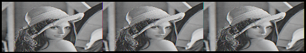

# Image-Interpolation-using-C

Interpolation is the process of estimating unknown values that falls between known values. 
This programs performs image interpolation, particularly for converting an image of size say (width x height) resolution to an image of size (2*"width" x height) resolution.

The image format used in this program is ".raw"

RAW format images are the ones which are captured by the camera without any compression and noise reduction.

Input Image of size 256x256 resolution 

Output Image of size 512x256 resolution obtained using the program

